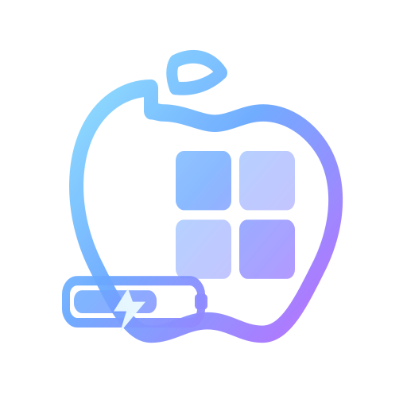

#  Magic Keyboard Monitor for Windows

A lightweight, elegant system tray utility that monitors the battery level of your Apple Magic Keyboard on Windows. 

## ✨ Features

* **Real-time Battery Monitoring**: Quietly runs in the background and displays the current battery level of your Magic Keyboard.
* **Universal Compatibility**: Supports both Bluetooth and USB connections (scans both `0x004C` and `0x05AC` Apple Vendor IDs).
* **Auto-Start Support**: Easily configure the app to launch automatically when Windows starts.
* **Modern UI**: A clean, fluent-design setup window and system tray integration.
* **Zero Dependencies**: Distributed as a portable, single-file executable (`.exe`). No installation required!

## 🚀 Getting Started

### Installation
1. Go to the [Releases](../../releases) page.
2. Download the latest `WinMagicBattery.zip`.
3. Extract the ZIP file to your preferred folder.
4. Double-click the APP.exe file to run ! (No installation or extra `.dll` files needed).

### How to Use
**NOTE: Your device must connect to your PC first!**
1. Launch the app. It will appear in your Windows System Tray (bottom right corner).
2. Right-click the tray icon and select **Settings**.
3. Select your connected Magic Keyboard from the dropdown menu.
4. Check **"Start automatically with Windows"** if you want it to run in the background permanently.
5. Click **Save & Start Monitoring**.

## 🔮 Future Work (Roadmap)

* **Customizable Low Battery Alerts**: Allow users to set a specific battery percentage threshold to trigger desktop notifications when it's time to recharge.
* **Extended Apple Ecosystem Support**: Expand compatibility beyond keyboards to monitor other Apple devices, such as AirPods, Magic Mouse, and Magic Trackpad.
* **Multi-Device Monitoring**: Support tracking and displaying the battery levels of multiple Apple devices simultaneously within the dashboard.

## 🛠️ Built With

* **C# / WPF** - The UI and core logic.
* **HidLibrary** - For low-level USB/Bluetooth HID communication.
* **.NET 8** - Packaged as a self-contained single-file executable.

## 🤝 Contributing

Contributions, issues, and feature requests are welcome! Feel free to check the [issues page](../../issues).

## 📝 License

This project is licensed under the MIT License.
